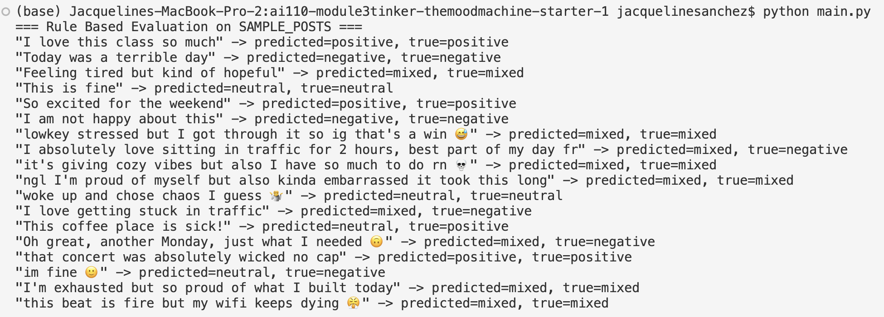
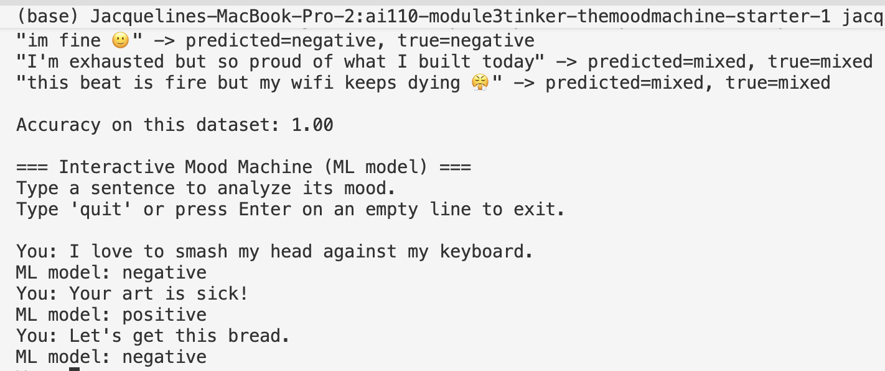

## Mood Analyzer Report Insight

The initial rule-based version of the mood analyzer started at 0.33 accuracy on SAMPLE_POSTS, using a simple approach where the sentiment was based purely on whether the score was > 0, < 0, or == 0.

From there, I added a “mixed” category, which brought the accuracy up to 0.55. This helped capture posts that had both positive and negative signals instead of forcing them into one side.

Next, I implemented negation handling, which improved the accuracy to 0.64. This made the model a bit more context-aware (like handling phrases such as “not good”), though there was still room for improvement.

The biggest jump came from changing the classification logic slightly. Before relying on the score, I added a quick check that looks at the actual words in the text. I count how many positive and negative words appear (pos_hits and neg_hits), and if both are present, I immediately label the post as “mixed.” Otherwise, it falls back to the original score-based rules.

That small addition made a big difference, bringing the accuracy up to 0.82. It showed that combining simple word level checks with scoring works better than just relying on the score alone.

After introducing the “breaker” sentences, the accuracy initially dropped to 0.63. After updating the positive and negative word lists based on these breaker cases, it improved to 0.72. This suggests that these edge cases exposed some limitations in the current rules and overall logic.

These breaker cases were intentionally designed to challenge the model and included things like sarcasm, slang with multiple meanings (e.g. “sick”, “wicked”, “fire”), emojis, and mixed emotions (e.g. “I’m exhausted but proud of myself”).

This showed that while the rule-based approach works well for more straightforward inputs, it struggles with more nuanced or context-heavy language.

## Running ml_experiments

When I ran the ML version, it achieved 1.00 accuracy on the dataset, compared to 0.72 from the rule-based model. This is likely because it was trained and tested on the same labeled examples, allowing it to closely learn those patterns.

The ML model handled several tricky “breaker” cases better. It correctly classified sarcasm like “I love getting stuck in traffic” as negative, understood slang like “sick” as positive, and handled subtle cases like “im fine 🙂” more accurately than the rule-based model.

However, it still struggled with less common slang. For example, “Let’s get this bread” was classified as negative, even though it’s typically positive, suggesting limited exposure in the training data.

Overall, the models fail in different ways, the rule-based model struggles with context (sarcasm, slang, emojis), while the ML model handles those better but may not generalize well to unseen language.

